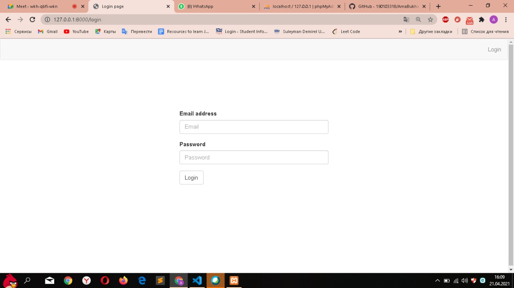
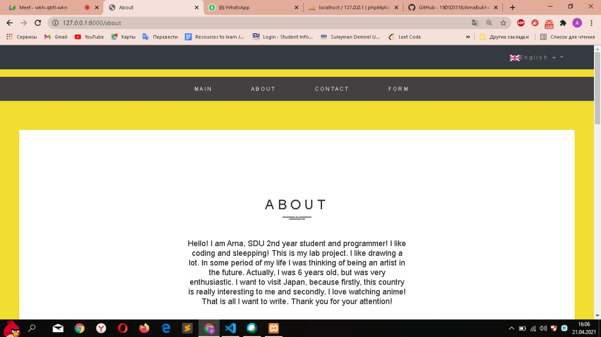
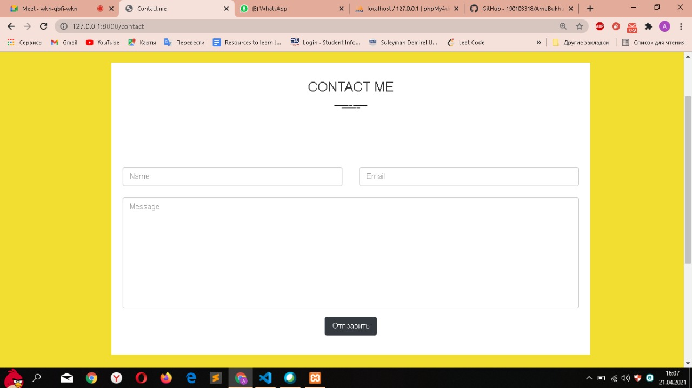
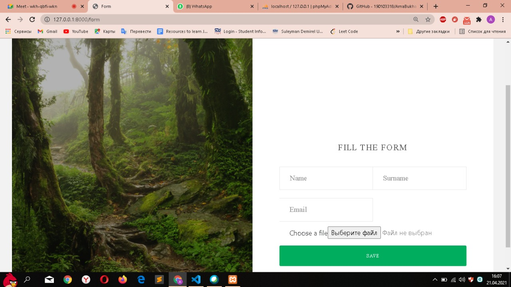
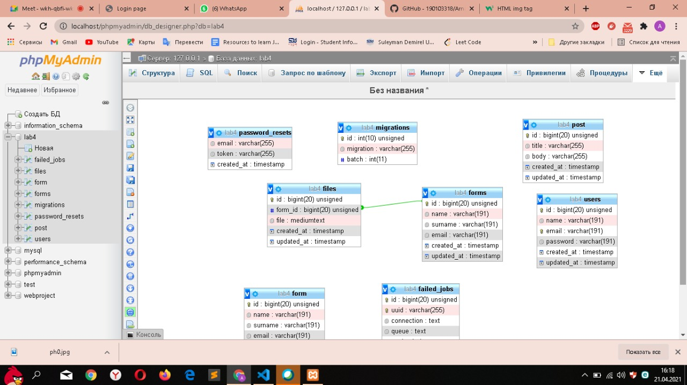

<h1>Documentation</h1>
<i>My web site is my portfolio. I have login page where I can enter my web site. Even though, I don't have registration, I have one user in my users table who can enter. Also I have 3 tables in my project which are Users, Forms, Files. ERD of them you can see below. Inside Users table I store all users with their passwords. And inside Forms and Files I store general information about user who filled form and file that he attached in form. These two tables related by one to one relation using foreign key form_id. Also visitors of my web site can leave send some feedback to my mail. It is happenning in contact page. I put here some conditions, so if visitor forgets to fill some field or write inappropriate email address some error alert comes out. </i>

##Login page:

##Main page:

##About page:

##Contact page:

##Form:

<h3 style="text-align: center; color: red">##ERD diagram:</h3>
